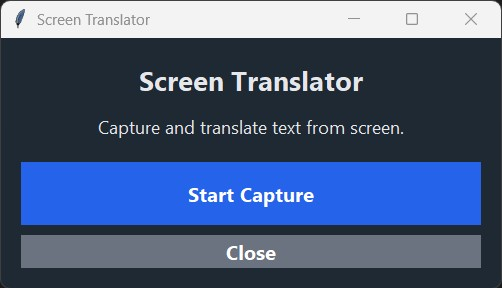
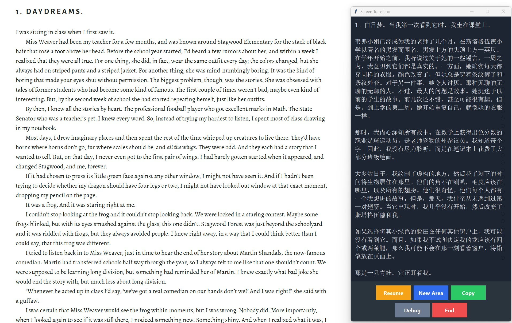

# Real Time Screen Translator (English to Chinese)

Screen Translator is a Python desktop tool for live translation of any text visible on your screen.  
It lets you draw a rectangle over part of your screen (e.g. a game, video, software UI), captures the text using OCR (Tesseract), and translates it into your target language (e.g. Chinese) in real time.

Ideal for:
- Playing games in English.
- Translating videos with subtitles.
- Translating software UIs or documents.

<br>


<br>


---

## ✨ Features

✅ Select any area of your screen to translate  
✅ Works with games, videos, images, or any visible text  
✅ OCR powered by Tesseract for high accuracy  
✅ Automatic paragraph detection for better translation  
✅ Clean and modern User Interface  
✅ Pause/resume capture anytime  
✅ Copy translation text to clipboard  
✅ Debug mode to preview OCR image output

---

## 🚀 Quick User Manual (for EXE users)

If you downloaded an EXE release:

1. **Run Screen Translator.exe**

2. Click:
    - **Start Capture** → your screen will dim
    - Draw a rectangle around the text area you want to translate

3. The translated text appears live in the window.

4. Use buttons to:
    - Pause / Resume
    - Select a New Area
    - Copy translation
    - Debug the OCR image
    - End the program

---

## ❤️ Support This Project
If you find this application useful, please consider supporting its development by buying me a coffee!

[](https://ko-fi.com/hakku99)

---

## 🐍 Installation (Python Users)

Want to run from Python instead of EXE?

### 1. Install Tesseract & Dependencies

**a. Install Tesseract OCR**

- Download and install Tesseract OCR:
    - Windows: [Tesseract at UB Mannheim](https://github.com/UB-Mannheim/tesseract/wiki)
    - macOS: `brew install tesseract`
    - Linux: `sudo apt install tesseract-ocr`

**b. Update Tesseract Path in Script**

- Open `screen-translator.py`.
- Find this line and update the path to your Tesseract installation:
  ```python
  pytesseract.pytesseract.tesseract_cmd = r'C:\Program Files\Tesseract-OCR\tesseract.exe'
  ```

### 2. Clone this repo

```bash
git clone https://github.com/Hakku99/real-time-screen-translator.git
cd screen-translator
```

### 3. Install Python Libraries

Install the required Python packages using pip:

```bash
pip install -r requirements.txt
```

### 4. Run the Script

```bash
python screen-translator.py
```

---

## ⚙️ Configuration (Optional)

You can customize the translator's behavior by editing the `Config` class at the top of `screen-translator.py`:

```python
class Config:
    TESSERACT_CONFIG = '--psm 6'
    UPSCALE_FACTOR = 3
    SHARPNESS_FACTOR = 2.0
    BW_THRESHOLD = 200
    SOURCE_LANGUAGE = 'english'
    TARGET_LANGUAGE = 'chinese (simplified)'
```

- **`SOURCE_LANGUAGE`**: The language of the text on your screen.
- **`TARGET_LANGUAGE`**: The language you want to translate to.
- **`UPSCALE_FACTOR`**, **`SHARPNESS_FACTOR`**, **`BW_THRESHOLD`**: Image processing settings to improve OCR accuracy. You can experiment with these if the text is not being detected correctly.

---

## 📜 License

This project is licensed under the MIT License - see the [LICENSE](LICENSE) file for details.